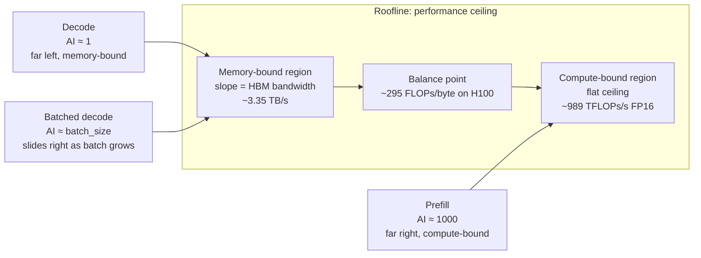

# How to Calculate GPU Inference - FLOPs Memory and Time

Parent: [[NVIDIA Stack]]

## 🪝 The Hook
Someone says "you can serve Llama-70B at 80 tokens per second on one H100." You want to know: is that true? Optimistic? Pessimistic? By the end of this chapter, you'll be able to compute the ceiling *from first principles* on the back of an envelope, and know whether any real number you see is close to it.

This is the workhorse chapter of the whole book. It ties [[Inside a GPU - SMs CUDA Cores and Tensor Cores]] and [[GPU Memory Hierarchy - HBM L2 SRAM Registers]] together into one usable mental model.

## ⚙️ Core Mechanism

### The two things we're going to calculate
For any (model, hardware, workload) combo, we want:

1. **FLOPs** — how much math is needed
2. **Bytes** — how much memory traffic is needed

Whichever one *takes longer* on the chip is the bottleneck. That gives us the time floor. Real systems reach 40–70% of that floor with well-optimized kernels.

### The reference chip — H100 (SXM 80GB)

We'll use these numbers throughout:

| Spec | H100 SXM |
|---|---|
| HBM capacity | 80 GB |
| HBM bandwidth | ~3.35 TB/s |
| Peak FP16 (Tensor Core, dense) | ~989 TFLOPs |
| Peak FP8 (Tensor Core, dense) | ~1,979 TFLOPs |
| Peak FP32 (CUDA cores) | ~67 TFLOPs |

(FP16 and FP8 use Tensor Cores. FP32 is much lower because it uses ordinary CUDA cores. Modern LLM inference lives in FP16 / BF16 / FP8 / INT4.)

---

### 1. FLOPs per token during decode ≈ `2 × N_params`

**Plain-English derivation:**

Every parameter (dial) is used exactly once per forward pass. Each use is a multiply-add — that's **2 floating point ops** (one multiply, one add). So per token:

$$\text{FLOPs}_{\text{decode}} \approx 2 \times N_{\text{params}}$$

**Worked example** — Llama-70B, decode one token:

$$2 \times 70 \times 10^9 = 1.4 \times 10^{11} \text{ FLOPs} = 140 \text{ GFLOPs}$$

That's 140 billion multiplications *per token*. Sounds huge. But an H100 does ~989,000 billion FP16 ops/second. So the *math time* is:

$$\frac{140 \text{ GFLOPs}}{989 \text{ TFLOPs/s}} = 0.14 \text{ ms per token} \Rightarrow \sim 7,000 \text{ tokens/sec}$$

If math were the only limit, we'd get 7,000 tok/s. We don't. We get maybe 30–80. Why? Read on.

---

### 2. FLOPs per token during prefill ≈ `2 × N_params × prompt_len`

Prefill processes the whole prompt in *one* forward pass, but each of the L prompt tokens still has to go through the model. So:

$$\text{FLOPs}_{\text{prefill}} \approx 2 \times N_{\text{params}} \times L$$

**Worked example** — Llama-70B prefill for a 1,000-token prompt:

$$2 \times 70 \times 10^9 \times 1000 = 1.4 \times 10^{14} \text{ FLOPs} = 140 \text{ TFLOPs}$$

Math time: `140 / 989 ≈ 141 ms`. So prefill of a 1000-token prompt has a math floor around 140ms. This is your **TTFT** floor from [[Latency - TTFT and TPOT]].

---

### 3. Memory traffic per decode step ≈ `model_size_in_bytes`

Now the ugly truth. To do that 140 GFLOPs of math per token, the GPU has to **load every single weight from HBM at least once** (each weight is used exactly once in the forward pass — no reuse across tokens in batch-size-1 decode).

- FP16 model → 2 bytes per param
- FP8 model → 1 byte per param
- INT4 model → 0.5 bytes per param

**Worked example** — Llama-70B in FP16:

$$70 \times 10^9 \times 2 \text{ bytes} = 140 \text{ GB}$$

Wait — that doesn't even fit on one H100 (80 GB). So Llama-70B FP16 needs at least 2 GPUs. Let's do the more realistic scenarios:

- **Llama-70B FP8** on 1× H100 → 70 GB of weights, just fits
- **Llama-70B INT4** on 1× H100 → 35 GB, room to spare

---

### 4. Decode tokens/sec ceiling ≈ `memory_bandwidth / model_size`

The decode ceiling comes straight from "how fast can we stream the model through HBM":

$$\text{tokens/sec}_{\max} \approx \frac{\text{HBM bandwidth}}{\text{model size in bytes}}$$

**Llama-70B FP8 on H100:**

$$\frac{3.35 \text{ TB/s}}{70 \text{ GB}} \approx 48 \text{ tokens/sec}$$

**Llama-70B INT4 on H100:**

$$\frac{3.35 \text{ TB/s}}{35 \text{ GB}} \approx 96 \text{ tokens/sec}$$

**Llama-70B FP16 on 2× H100 (NVLinked, so combined 6.7 TB/s effective):**

$$\frac{6.7 \text{ TB/s}}{140 \text{ GB}} \approx 48 \text{ tokens/sec}$$

**Real-world observed:** ~30–70 tok/s depending on kernel quality, KV cache size, batch size, etc. Our ceilings above are within ~1.5× of reality. Not bad for an envelope.

Key insight: **quantization doesn't just save memory. It literally doubles or quadruples decode speed on the same hardware.** Same reasoning as [[Quantization]].

---

### 5. Arithmetic intensity — the one number that tells you the bottleneck

$$\text{AI} = \frac{\text{FLOPs}}{\text{bytes moved}}$$

Decode, batch size 1:
- FLOPs: `2 × N_params`
- Bytes: `N_params × precision_bytes` (say 2 for FP16)
- AI ≈ `2 / 2 = 1 FLOP/byte`

Prefill, prompt length 1000:
- FLOPs: `2 × N_params × 1000`
- Bytes: `N_params × 2` (weights loaded once, reused across all 1000 positions)
- AI ≈ `1000 FLOPs/byte`

**H100's balance point** — the arithmetic intensity where compute and memory tie:

$$\text{AI}_{\text{H100, FP16}} = \frac{989 \text{ TFLOPs/s}}{3.35 \text{ TB/s}} \approx 295 \text{ FLOPs/byte}$$

- AI < 295 → **memory-bound** (decode lives here at ~1)
- AI > 295 → **compute-bound** (prefill lives here at ~1000)

This is why decode is a memory-bandwidth problem and prefill is a compute problem. See [[Prefill and Decode]] for the qualitative version.

---

### 6. The Roofline model

The classic mental picture — one diagram, everything visible at once.



**In plain English:** the roofline is a ceiling with two slopes. On the left, a diagonal line rising with bandwidth. On the right, a flat line at peak compute. Your workload plots as a dot at (arithmetic intensity, achieved FLOPs/sec). The dot's ceiling is the roofline. Anything below the roofline is inefficiency (bad kernels, cache misses, warp stalls).

Decode sits far left, hugging the memory-bound slope. Prefill sits far right, hugging the compute ceiling. All GPU optimization is "push my dot toward the ceiling and slide it right."

---

### 7. How batching moves you along the roofline

Batching reuses each weight across `B` different users' tokens in one load. So:

$$\text{AI}_{\text{batched decode}} \approx B \text{ FLOPs/byte}$$

- Batch 1: AI ≈ 1 (deep memory-bound)
- Batch 32: AI ≈ 32 (still memory-bound)
- Batch 256: AI ≈ 256 (approaching balance point)
- Batch 512+: AI > 295 (crosses into compute-bound territory)

This is the *arithmetic reason* [[Batching and Throughput]] works. You literally slide your workload right along the roofline until you hit the compute ceiling. Beyond that, batching adds latency without adding throughput.

Caveat: bigger batches need bigger KV cache in HBM ([[KV Cache]]). At some point you run out of HBM and can't grow the batch further. Which is why practical batch sizes on H100 top out around 128–256 for big models.

---

### 8. How quantization moves you along the roofline

Quantization shrinks `bytes moved` without changing `FLOPs`. So:

- FP16 → FP8: AI **doubles**. Decode gets ~2× throughput.
- FP16 → INT4: AI **quadruples**. Decode gets ~4× throughput (until you hit compute-bound territory).

Plus you get more room in HBM for bigger KV caches, bigger batches, bigger models. See [[Quantization]] for the "does the model still work" side.

---

### 9. The back-of-envelope box (memorize this)

For any modern LLM on any modern GPU, in this order:

```
STEP 1  Model memory footprint:
        M = N_params × bytes_per_param

STEP 2  Does it fit?
        Need M + KV_cache < HBM_capacity
        (Otherwise: multiple GPUs, see NVLink chapter)

STEP 3  Decode tokens/sec ceiling (batch = 1):
        tok/s ≈ HBM_bandwidth / M

STEP 4  Prefill TTFT floor for prompt length L:
        TTFT ≈ (2 × N_params × L) / peak_TFLOPs

STEP 5  Arithmetic intensity of your workload:
        AI ≈ batch_size    (decode)
        AI ≈ prompt_length (prefill, batch 1)

STEP 6  Bottleneck:
        AI < peak_TFLOPs / HBM_bandwidth  →  memory-bound
        AI > peak_TFLOPs / HBM_bandwidth  →  compute-bound

STEP 7  Real system reaches ~40–70% of these ceilings.
        If they claim >70%, be suspicious.
        If they hit <30%, kernel/config is bad.
```

That's the whole calculator. Print it and stick it to your monitor.

## 🔗 Connects To
- [[NVIDIA Stack]]
- [[Inside a GPU - SMs CUDA Cores and Tensor Cores]] — where the FLOPs come from
- [[GPU Memory Hierarchy - HBM L2 SRAM Registers]] — where the bandwidth wall lives
- [[How a Matmul Runs on a GPU]] — the kernel side of hitting these ceilings
- [[Prefill and Decode]] — the AI-facing version of "compute-bound vs memory-bound"
- [[Batching and Throughput]] — arithmetic intensity via batching
- [[Quantization]] — arithmetic intensity via smaller bytes
- [[Cost of Inference]] — this chapter is the physics that decides that chapter's economics
- [[Latency - TTFT and TPOT]] — TTFT floor = prefill math; TPOT floor = decode memory

## 💡 So What
Any AI provider's tokens/sec claim can now be sanity-checked in one minute: model size × bandwidth / memory footprint ≈ ceiling. If they claim numbers well above that, either their model is quantized more than they said, or they're batching harder than they told you, or the number is wrong.

## ❓ Open Question
The "2 FLOPs per param" heuristic breaks for Mixture of Experts (MoE) — only some experts activate per token. The right formula becomes `2 × active_params`. But *bytes moved* still includes all experts if they can't be pinned in cache. What's the correct MoE roofline formula? I've seen conflicting versions.

## 📚 Source
- "Roofline: An Insightful Visual Performance Model" — Williams et al., Comm. ACM 2009 — the original roofline paper
- NVIDIA H100 whitepaper — for the peak numbers used above
- Semianalysis and Horace He's blog posts on LLM inference arithmetic
- Companion to [[Prefill and Decode]] and [[Cost of Inference]]

---
*Status key: 🌱 seedling → 🌿 growing → 🌳 evergreen*
