# NIM - NVIDIA Inference Microservices

Parent: [[NVIDIA Stack]]

## 🪝 The Hook
Everything in this book so far — SMs, HBM, CUDA, TensorRT-LLM, Triton — is a lot to stand up correctly just to answer one chat question. What if you could skip all of it and just run `docker run nvcr.io/nim/meta/llama3-70b` and get a production-grade, GPU-optimized chat API in one command? That's the entire pitch of **NIM**.

## ⚙️ Core Mechanism

### What a NIM actually is

A **NIM (NVIDIA Inference Microservice)** is a **prepackaged container** that bundles:

- A specific model's weights (or a pointer to fetch them with your NGC key)
- One or more **pre-compiled TensorRT-LLM engines**, built ahead of time for several common GPUs (see [[TensorRT and TensorRT-LLM]])
- A **Triton Inference Server** instance configured to serve that engine (see [[Triton Inference Server]])
- A thin **OpenAI-compatible REST API** layer on top
- Health checks, Prometheus metrics, logging — all wired up
- Startup logic that detects your GPU and loads the matching engine

In one sentence: **NIM = model + compiled runtime + server + API, shipped as a single container, so you don't have to build any of the previous six chapters yourself.**

### Why it exists

Before NIM, deploying a model in production meant:
1. Get weights
2. Write/find a TensorRT-LLM build script, tune it for your GPU
3. Wire it into Triton, write `config.pbtxt`
4. Write an API shim so your app doesn't need to know Triton's protocol
5. Add health checks, metrics, logging by hand
6. Repeat steps 2–5 for every GPU type you deploy on

That's real ML infrastructure engineering — days to weeks of work, redone per model, per GPU. NIM's whole value proposition: **collapse all of that into "pull a container, run it."** Enterprises without a dedicated inference-optimization team can get near-optimal performance without hiring one.

### Anatomy of a NIM container

```
nim-llama3-70b-instruct/
├── (base image: CUDA + Triton + TensorRT-LLM runtime, NVIDIA-maintained)
├── /opt/nim/
│   ├── model_repo/                    ← Triton model repository layout
│   │   └── llama3-70b/
│   │       ├── config.pbtxt
│   │       └── 1/model.plan           ← chosen at startup, per-GPU
│   ├── engines/
│   │   ├── h100_fp8/                  ← pre-built engine for H100
│   │   ├── a100_fp16/                 ← pre-built engine for A100
│   │   ├── l40s_fp8/                  ← pre-built engine for L40S
│   │   └── a10g_int8/                 ← pre-built engine for A10G
│   ├── api_server/                    ← OpenAI-compatible REST shim
│   └── entrypoint.sh                  ← GPU detection + engine selection logic
```

At container startup, `entrypoint.sh` runs `nvidia-smi`-style detection, matches the GPU model to an available pre-built engine, and boots Triton pointed at that engine. If your exact GPU isn't in the pre-built set, some NIMs support **just-in-time compilation** — building the engine locally on first startup (slower first boot, then cached).

### The API surface

NIM's whole appeal is that it looks like a familiar API, not a research tool:

| Endpoint | Purpose |
|---|---|
| `POST /v1/chat/completions` | OpenAI-compatible chat, same schema as OpenAI's API |
| `POST /v1/completions` | Raw text completion |
| `POST /v1/embeddings` | Embedding models (NIM also ships embedding/rerank models) |
| `GET /v1/models` | List loaded model(s) |
| `GET /v1/health/live` | Is the process alive |
| `GET /v1/health/ready` | Is the model loaded and ready to serve |
| `GET /metrics` | Prometheus metrics (queue depth, latency, throughput) |

Because it mimics OpenAI's schema, most existing tools (LangChain, LlamaIndex, the OpenAI Python client itself) work by just pointing `base_url` at your NIM instance. That compatibility is a deliberate adoption strategy.

### Auth, licensing, and where models come from

- Models and containers are hosted on **NGC (NVIDIA GPU Cloud) catalog** — a registry of pre-built containers and models
- Pulling requires an **NGC API key** tied to an NVIDIA account, often gated behind an **NVIDIA AI Enterprise** license for production use (see [[NeMo NGC and Enterprise AI]])
- NIM supports **air-gapped / on-prem deployment** — pull once, mirror to a private registry, run with no outbound internet — important for regulated industries
- Some NIMs wrap open-weight models (Llama, Mistral) — the container/optimization is NVIDIA's value-add, the weights are open

### Worked example — running a NIM

```bash
# Log in to NGC registry with your API key
echo "$NGC_API_KEY" | docker login nvcr.io --username '$oauthtoken' --password-stdin

# Run a NIM container serving Llama-3-8B-Instruct
docker run -d --name llama3-nim \
  --gpus all \
  --shm-size=16GB \
  -e NGC_API_KEY=$NGC_API_KEY \
  -e NIM_MODEL_PROFILE=auto \
  -v ~/.cache/nim:/opt/nim/.cache \
  -p 8000:8000 \
  nvcr.io/nim/meta/llama3-8b-instruct:latest

# Wait for readiness
curl -s http://localhost:8000/v1/health/ready

# Send a chat request, OpenAI-style
curl -s http://localhost:8000/v1/chat/completions \
  -H "Content-Type: application/json" \
  -d '{
        "model": "meta/llama3-8b-instruct",
        "messages": [{"role": "user", "content": "Explain HBM in one sentence."}],
        "max_tokens": 100
      }'
```

Notes on the flags: `--gpus all` passes GPUs through to the container (needs the NVIDIA Container Toolkit installed on the host); `--shm-size` is bumped up because Triton/TensorRT-LLM use shared memory for inter-process tensor passing; the cache volume avoids re-downloading multi-gigabyte engine files on every restart.

### Relationship diagram

```mermaid
flowchart LR
    NGC[NGC Catalog<br/>models + containers]
    NIM[NIM container<br/>API + GPU-detect logic]
    TRITON[Triton Inference Server<br/>inside the container]
    TRT[TensorRT-LLM engine<br/>pre-compiled per GPU]
    CUDA[CUDA runtime + driver]
    GPU[Physical GPU<br/>H100 / L40S / A10G]

    NGC -->|docker pull| NIM
    NIM -->|serves via| TRITON
    TRITON -->|executes| TRT
    TRT -->|calls| CUDA
    CUDA -->|runs on| GPU

    click NGC "NeMo NGC and Enterprise AI.md"
    click TRITON "Triton Inference Server.md"
    click TRT "TensorRT and TensorRT-LLM.md"
    click CUDA "CUDA and the Driver.md"
```



### What NIM is NOT

- **Not a training system.** NIM only serves; fine-tuning/training happens elsewhere (e.g., NeMo).
- **Not a replacement for Triton.** It's Triton, pre-configured and hidden behind a friendlier API — for most (not all) NIMs.
- **Not free-as-in-beer at scale.** The container itself may be pullable freely for eval, but production use typically needs an NVIDIA AI Enterprise license.
- **Not automatically the fastest possible setup.** A hand-tuned, custom TensorRT-LLM build for your exact workload can sometimes beat the generic pre-built NIM engine. NIM optimizes for "very good, zero effort," not "absolute maximum, expert effort."

## 🔗 Connects To
- [[NVIDIA Stack]]
- [[TensorRT and TensorRT-LLM]] — the compiled engine every NIM ships
- [[Triton Inference Server]] — the serving layer underneath most NIMs
- [[NVIDIA GPU Generations - A100 H100 H200 B200 GB200]] — the reason "which engine for which GPU" is a real problem
- [[NIM Operator on Kubernetes]] — how NIMs get run reliably at fleet scale
- [[NeMo NGC and Enterprise AI]] — licensing and catalog context
- [[Cost of Inference]] — NIM trades a licensing cost for saved engineering time

## 💡 So What
When evaluating "should we build our own inference stack or use NIM," the real trade-off is engineering time and expertise versus licensing cost and flexibility. NIM is the right call when you want a known-good deployment fast; a custom TensorRT-LLM + Triton build is the right call when you need to squeeze out the last 10–20% of performance or need something NIM doesn't ship.

## ❓ Open Question
How much performance is actually left on the table by NIM's generic pre-built engines versus a fully hand-tuned TensorRT-LLM build for one specific workload's exact batch sizes and sequence lengths? I've seen NVIDIA claim "near-optimal" but haven't found independent third-party benchmarks comparing the two directly.

## 📚 Source
- NVIDIA NIM documentation (`docs.nvidia.com/nim`)
- NVIDIA NGC catalog (`catalog.ngc.nvidia.com`)
- NVIDIA developer blog: "NVIDIA NIM Offers Optimized Inference Microservices" (2024)

---
*Status key: 🌱 seedling → 🌿 growing → 🌳 evergreen*
