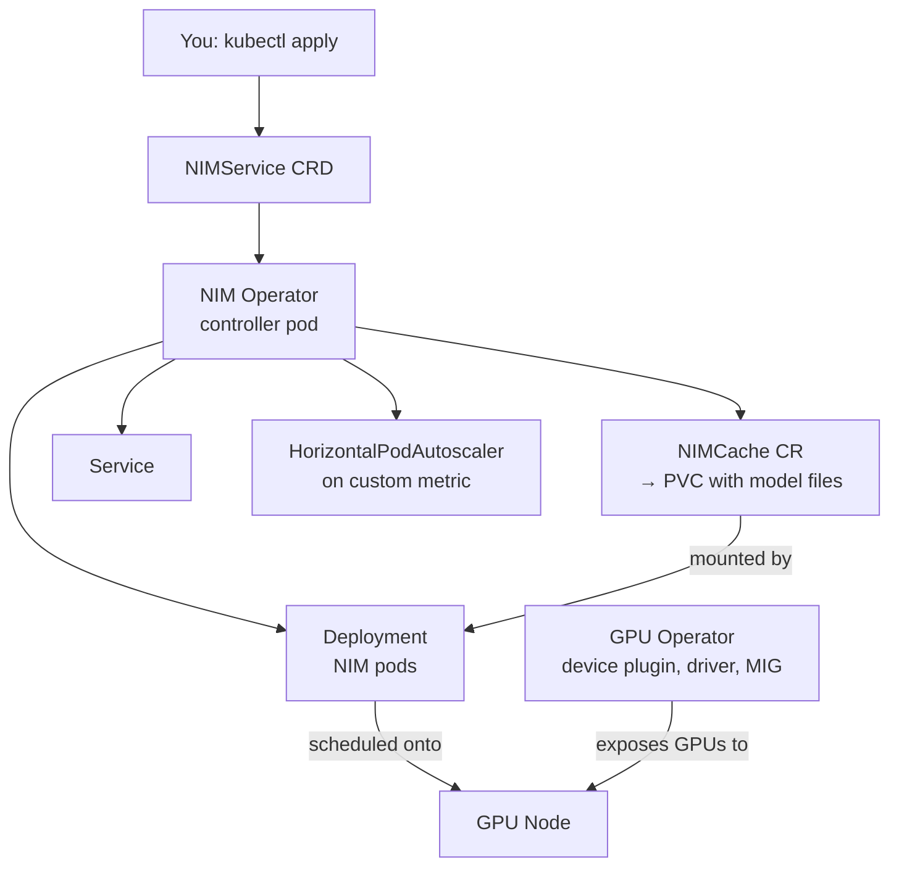

# NIM Operator on Kubernetes

Parent: [[NVIDIA Stack]]

## 🪝 The Hook
Running one NIM container with `docker run` is easy. Running **fifty** NIMs, across a fleet of GPU nodes, that need to survive pod restarts, share an 80GB model cache instead of re-downloading it fifty times, and scale up when traffic spikes — that's not a `docker run` problem anymore. That's a **Kubernetes Operator** problem.

## ⚙️ Core Mechanism

### What a Kubernetes Operator is, in plain English

Regular Kubernetes objects (Pods, Deployments, Services) are generic — Kubernetes knows how to run *any* container, but knows nothing about *your specific application's* needs. A **Custom Resource Definition (CRD)** lets you teach Kubernetes a new noun — like `NIMService` — and an **Operator** is a piece of software (itself running as a pod) that watches for objects of that new kind and does whatever work is needed to make reality match what you asked for.

The pattern is always the same loop, called **reconciliation**:

```
1. Watch: "has anyone created/changed a NIMService object?"
2. Compare: "what does the cluster look like right now vs what was asked for?"
3. Act: create/update/delete Deployments, Services, PVCs, etc. to close the gap
4. Repeat forever
```

Kitchen version: a regular Deployment is like telling one line cook "make this dish." An Operator is like hiring a **shift manager** who watches the whole kitchen board, notices when a dish needs a bigger pot, extra prep staff, or a fresh delivery from the pantry, and handles all of that without you personally issuing every individual instruction.

### Why plain Kubernetes objects aren't enough for NIM

A working NIM deployment needs several coordinated pieces:

- The right **GPU node** — tainted/labeled correctly, right GPU type for the model's pre-built engine
- A shared **model cache** so the 30–80GB of engine/weight files download once, not once per pod
- **Autoscaling rules** tied to AI-specific signals (queue depth, tokens/sec) rather than generic CPU%
- Coordinated **upgrades** — swap model versions without dropping in-flight requests
- Sometimes, **multi-step pipelines** (e.g., embedding model → retrieval → chat model)

Wiring all of that by hand, per model, per environment, is exactly the kind of repetitive glue-work Operators exist to automate.

### The Custom Resources — what I know vs. what to verify

NVIDIA publishes a **NIM Operator** for Kubernetes with (per their docs at the time of writing) resources along these lines:

- **`NIMService`** — declares "run this NIM model, with this GPU request, this scaling policy, this cache reference." The Operator turns this into a Deployment + Service + (optionally) HorizontalPodAutoscaler.
- **`NIMCache`** — declares "pre-fetch and store this model's engine/weight files in a shared volume" so `NIMService` pods mount it instead of downloading it themselves.
- **`NIMPipeline`** — declares a multi-model pipeline (e.g., chaining an embedding NIM and a chat NIM together).

⚠️ I'm not fully certain these exact three CRD names and their precise field schemas are current/complete — NVIDIA's operator API has evolved and I don't have verified up-to-date documentation in front of me. Treat these as "the shape of the idea," and check `docs.nvidia.com` for the current CRD spec before writing real YAML against it. Flagged properly in Open Question below.

**Illustrative (not guaranteed exact) `NIMService` YAML:**

```yaml
apiVersion: apps.nvidia.com/v1alpha1
kind: NIMService
metadata:
  name: llama3-70b-chat
spec:
  image:
    repository: nvcr.io/nim/meta/llama3-70b-instruct
    tag: latest
  storage:
    nimCache:
      name: llama3-70b-cache        # references a NIMCache object
  replicas: 2
  resources:
    limits:
      nvidia.com/gpu: 1
  expose:
    service:
      port: 8000
  scale:
    minReplicas: 1
    maxReplicas: 8
    metric: nim_tokens_per_second   # illustrative custom metric name
```

### Architecture diagram



### The reconciliation loop, step by step (for `NIMService`)

1. You `kubectl apply` a `NIMService` manifest
2. The Operator's controller sees a new/changed object via the Kubernetes API watch
3. It checks: does a matching Deployment exist? Right image, right replica count, right GPU request?
4. If not, it creates/patches the Deployment, Service, and (if configured) HPA
5. It checks: is the referenced `NIMCache` ready? If the cache PVC isn't populated yet, it waits/blocks pod scheduling
6. Once the Deployment is healthy (pods pass `/v1/health/ready`), the Operator marks the `NIMService` status as `Ready`
7. Any drift (someone manually edits the Deployment, a node dies) gets detected and corrected on the next reconcile pass — this loop never stops

### The model cache problem, and how it's solved

A 70B model's engine files can be tens of gigabytes. If every pod downloaded its own copy from NGC on startup:
- Slow cold starts (many minutes)
- Wasted egress bandwidth
- Wasted storage (N replicas × 40GB each)

The `NIMCache` pattern: one controller-managed job pre-downloads the files **once** into a **ReadWriteMany (RWX) Persistent Volume Claim** (backed by something like NFS, or a cloud provider's shared filesystem). Every `NIMService` pod then mounts that same PVC read-only. New pods start in seconds instead of minutes because the heavy download already happened.

### Riding on top of the GPU Operator

The NIM Operator assumes GPUs are already usable in the cluster — that's a separate, more foundational piece called the **NVIDIA GPU Operator**, which handles:

- **Device plugin** — advertises `nvidia.com/gpu` as a schedulable resource
- **Driver installation** — installs/manages the NVIDIA driver on each node via a DaemonSet
- **MIG (Multi-Instance GPU)** — partitions one physical GPU into several isolated smaller GPUs, if configured
- **Time-slicing** — lets multiple pods share one GPU by time-sharing, for workloads that don't need a whole GPU

The NIM Operator schedules pods *requesting* `nvidia.com/gpu: 1` — it relies entirely on the GPU Operator having already made that resource visible and functional on the node. Two operators, two layers, one depends on the other.

### Autoscaling on AI-specific metrics

Generic Kubernetes HPA scales on CPU/memory %, which is nearly meaningless for GPU inference (a GPU can be "busy" at 100% SM utilization while still having queue headroom, or vice versa). Real setups typically wire:

- **Triton's Prometheus metrics** (queue time, inference latency, requests in flight — see [[Triton Inference Server]])
- A **Prometheus** instance scraping those metrics
- **KEDA** (Kubernetes Event-Driven Autoscaling) or a custom-metrics-adapter feeding those into an HPA
- Scaling rules like "if average queue depth > 10 requests, add a replica" or "if tokens/sec per pod drops below X, scale out"

### Worked walkthrough (illustrative)

```bash
# 1. Install the NIM Operator via Helm
helm repo add nvidia-nim https://helm.ngc.nvidia.com/nvidia/nim
helm install nim-operator nvidia-nim/nim-operator \
  --namespace nim-system --create-namespace

# 2. Create a secret with your NGC API key for image pulls
kubectl create secret docker-registry ngc-secret \
  --docker-server=nvcr.io \
  --docker-username='$oauthtoken' \
  --docker-password=$NGC_API_KEY \
  -n default

# 3. Apply a NIMCache to pre-fetch Llama-3 engine files
kubectl apply -f llama3-nimcache.yaml

# 4. Apply a NIMService referencing that cache
kubectl apply -f llama3-nimservice.yaml

# 5. Watch pods come up
kubectl get pods -w

# 6. Once ready, port-forward and curl the OpenAI-compatible endpoint
kubectl port-forward svc/llama3-70b-chat 8000:8000
curl -s http://localhost:8000/v1/chat/completions \
  -H "Content-Type: application/json" \
  -d '{"model":"meta/llama3-70b-instruct","messages":[{"role":"user","content":"hi"}]}'
```

### Common failure modes

| Symptom | Likely cause |
|---|---|
| Pods stuck `Pending` forever | No GPU nodes with matching taint/label; GPU Operator not installed or unhealthy |
| `ImagePullBackOff` | Missing/expired `ngc-secret`, or NGC API key lacks entitlement for that image |
| Pod starts, then OOM-killed | Model too big for GPU memory, or `NIMCache` PVC undersized so engine files got truncated |
| Long cold start every time | `NIMCache` not actually shared (RWX) — each pod re-downloading independently |
| `/v1/health/ready` never turns green | Wrong engine profile for the GPU (e.g., H100 engine on an L40S node) |
| Autoscaler does nothing under load | Custom metrics pipeline (Prometheus → KEDA/HPA) misconfigured or metric name mismatch |

### Fitting into the bigger cluster-autoscaling picture

The NIM Operator scales **pods**. Something else has to scale **nodes** when there simply aren't enough GPU machines to place those pods on:

- **Cluster Autoscaler** — the traditional Kubernetes answer; adds/removes nodes from a fixed set of node groups
- **Karpenter** — a newer, faster, more flexible node provisioner (originally AWS, now broader); picks GPU instance types on demand based on pending pod requirements, often faster to react than Cluster Autoscaler

In a well-built GPU platform: KEDA/HPA scales NIM pods based on token throughput → pending pods with unmet GPU requests trigger Karpenter/Cluster Autoscaler → new GPU nodes join the cluster → GPU Operator makes them usable → NIM Operator's pods schedule onto them. Several layers, each doing one job.

## 🔗 Connects To
- [[NVIDIA Stack]]
- [[NIM - NVIDIA Inference Microservices]] — the container this Operator manages
- [[Triton Inference Server]] — the source of the metrics autoscaling depends on
- [[DGX HGX and Superpods]] — the physical GPU nodes this all schedules onto
- [[Batching and Throughput]] — why per-pod throughput, not CPU%, is the right autoscaling signal
- [[Cost of Inference]] — autoscaling is the operational lever that controls idle-GPU waste

## 💡 So What
If a team is running more than a couple of NIMs, or needs reliability guarantees, "just `docker run` it" stops being enough — the Operator pattern (shared cache, GPU-aware scheduling, metric-based autoscaling) is what turns a demo into a production service. Evaluate any GPU platform by asking whether these four problems (node selection, model cache, autoscaling signal, upgrades) are solved or left to you.

## ❓ Open Question
I flagged this above but it's worth restating clearly: I am **not certain** the CRD names `NIMService`, `NIMCache`, and `NIMPipeline` — and the exact YAML fields I sketched — match the current, real NVIDIA NIM Operator API precisely. NVIDIA's operator tooling has moved fast. Before writing real manifests, check the live docs at `docs.nvidia.com` and the Operator's CRD reference (`kubectl explain nimservice`, once installed) rather than trusting this note's YAML verbatim.

## 📚 Source
- NVIDIA NIM Operator documentation (`docs.nvidia.com` — verify current CRD schema before use)
- NVIDIA GPU Operator documentation
- Kubernetes Operator pattern — official Kubernetes docs, "Operator pattern"
- KEDA documentation — custom/external metrics scaling
- Karpenter documentation — node autoprovisioning

---
*Status key: 🌱 seedling → 🌿 growing → 🌳 evergreen*
