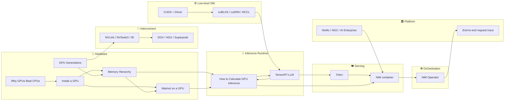

# 🟩 NVIDIA Stack — The Big Simple Book

Parent: [[AI and Compute]]

> If [[AI Inferencing]] was the *restaurant*, this book is the *whole city* the restaurant lives in — the power grid, the roads, the suppliers, the kitchens. NVIDIA owns most of it. Understanding that stack is understanding why AI feels the way it feels.

---

## 🪝 Why a whole book on one company's stack

You cannot understand modern AI without understanding NVIDIA's stack. Not because NVIDIA is the only game in town, but because their stack sets the *shape* everyone else copies. When you use ChatGPT, Claude, Gemini, your data almost certainly passes through:

- A **tensor core** doing the actual multiplication
- A **CUDA kernel** telling that tensor core what to do
- A **TensorRT-LLM engine** that compiled the model down to those kernels
- A **Triton server** managing the request queue
- A **NIM container** wrapping it all in a REST API
- A **NIM Operator** on Kubernetes keeping it healthy

That's the stack. Each layer sits on the one below. Change one, and everything above wobbles.

By the end of this book you should be able to point at any AI product and roughly guess *which layer* is limiting it — silicon, interconnect, runtime, serving, or orchestration.

---

## 🗺️ Diagram 1 — The layered stack (top to bottom)

```mermaid
flowchart TB
    APP[End-user app<br/>ChatGPT, Copilot, your own thing]
    NEMO[NeMo / AI Enterprise<br/>frameworks + licensing]
    NIMOP[NIM Operator<br/>Kubernetes controller]
    NIM[NIM container<br/>model + runtime + REST API]
    TRITON[Triton Inference Server<br/>request queue + batching]
    TRT[TensorRT-LLM<br/>compiled optimized engine]
    LIBS[cuBLAS / cuDNN / NCCL<br/>math + collectives]
    CUDA[CUDA runtime + driver<br/>talks to the chip]
    CLUSTER[Cluster<br/>InfiniBand + ConnectX]
    DGX[DGX / HGX node<br/>8 GPUs on one board]
    NVL[NVLink + NVSwitch<br/>chip-to-chip fabric]
    GPU[GPU package<br/>H100 / B200]
    SM[Streaming Multiprocessor<br/>a small city of cores]
    TC[Tensor Cores<br/>the actual math]

    APP --> NEMO --> NIMOP --> NIM --> TRITON --> TRT --> LIBS --> CUDA
    CUDA --> CLUSTER --> DGX --> NVL --> GPU --> SM --> TC

    click APP "Putting It All Together - One Request Through the Whole Stack.md"
    click NEMO "NeMo NGC and Enterprise AI.md"
    click NIMOP "NIM Operator on Kubernetes.md"
    click NIM "NIM - NVIDIA Inference Microservices.md"
    click TRITON "Triton Inference Server.md"
    click TRT "TensorRT and TensorRT-LLM.md"
    click LIBS "cuBLAS cuDNN and NCCL.md"
    click CUDA "CUDA and the Driver.md"
    click CLUSTER "NVLink NVSwitch and InfiniBand.md"
    click DGX "DGX HGX and Superpods.md"
    click NVL "NVLink NVSwitch and InfiniBand.md"
    click GPU "NVIDIA GPU Generations - A100 H100 H200 B200 GB200.md"
    click SM "Inside a GPU - SMs CUDA Cores and Tensor Cores.md"
    click TC "Inside a GPU - SMs CUDA Cores and Tensor Cores.md"
```

Read that top-to-bottom for "what happens to my request," or bottom-to-top for "what did NVIDIA build to make this possible."

---

## 🕸️ Diagram 2 — The knowledge graph (how the concepts influence each other)

---

## 📚 How to read this book

Go in order. Every chapter leans on the one before it. Skipping is punished with confusion.

### Part 1 — Ground floor: how a GPU actually computes AI
1. [[Why GPUs Beat CPUs at AI]]
2. [[Inside a GPU - SMs CUDA Cores and Tensor Cores]]
3. [[GPU Memory Hierarchy - HBM L2 SRAM Registers]]
4. [[How a Matmul Runs on a GPU]]
5. [[How to Calculate GPU Inference - FLOPs Memory and Time]] ⭐ the math chapter

### Part 2 — The chips themselves
6. [[NVIDIA GPU Generations - A100 H100 H200 B200 GB200]]
7. [[NVLink NVSwitch and InfiniBand]]
8. [[DGX HGX and Superpods]]

### Part 3 — The software stack (bottom → top)
9. [[CUDA and the Driver]]
10. [[cuBLAS cuDNN and NCCL]]
11. [[TensorRT and TensorRT-LLM]]
12. [[Triton Inference Server]]
13. [[NIM - NVIDIA Inference Microservices]] ⭐ product chapter
14. [[NIM Operator on Kubernetes]] ⭐ ops chapter

### Part 4 — The bigger picture
15. [[NeMo NGC and Enterprise AI]]
16. [[Putting It All Together - One Request Through the Whole Stack]]

---

## ⚙️ The 60-second version of everything

- A **GPU** is a chip with thousands of tiny math units. AI math (matrix multiply) fits it perfectly.
- Those units live in groups called **Streaming Multiprocessors (SMs)**. Inside each SM, **Tensor Cores** do the fat matrix work; **CUDA cores** do the everything-else math.
- The bottleneck is almost never math. It's **memory bandwidth** — how fast weights can get from HBM into the SM. This one fact explains ~70% of GPU design.
- **NVLink + NVSwitch** stitch 8+ GPUs into one giant "virtual GPU." **InfiniBand** stitches nodes into clusters. Interconnect quality matters as much as chip speed.
- **CUDA** is the language; **cuBLAS/cuDNN/NCCL** are the ready-made math kits; **TensorRT-LLM** compiles a model into an optimized engine; **Triton** serves it; **NIM** wraps it in a REST API; **NIM Operator** runs it on Kubernetes.
- **NeMo + NGC + AI Enterprise** is the platform layer — frameworks, catalog, and support contracts that make enterprises actually deploy.
- Every improvement in AI cost or latency comes from squeezing one of these layers. Knowing which layer moved tells you the story of the improvement.

---

## 🔗 Connects To
- [[AI and Compute]] — parent cluster
- [[AI Inferencing]] — the "how inference works" book this one plugs into
- [[Inference Hardware]] — the vendor-agnostic version of chapters 1–2 here
- [[Parallelism]] — training's version of the interconnect story
- [[Cost of Inference]] — where all the levers in this stack ultimately show up as $/token

## 💡 So What
After this book, "we run on 8× H100s" won't be a magic phrase. I should be able to translate any AI deployment into: which chip, which interconnect, which runtime, which server, which orchestration. Those five answers explain most of the performance and cost.

## ❓ Open Question (for the whole book)
NVIDIA's software moat (CUDA + all the libraries + the operators) is arguably bigger than their hardware moat now. If AMD's ROCm or a Triton-like compiler ever fully closes the software gap, does the hardware advantage disappear overnight — or is the vertical lock-in too deep by that point?

## 📚 Sources
- NVIDIA H100 Tensor Core GPU Architecture whitepaper (2022)
- Hopper / Blackwell architecture posts on the NVIDIA Developer Blog
- CUDA Programming Guide (current)
- TensorRT-LLM GitHub repository
- Triton Inference Server documentation
- NIM & NIM Operator docs on `docs.nvidia.com`
- Companion to [[AI Inferencing]]

---
*Status key: 🌱 seedling → 🌿 growing → 🌳 evergreen*
