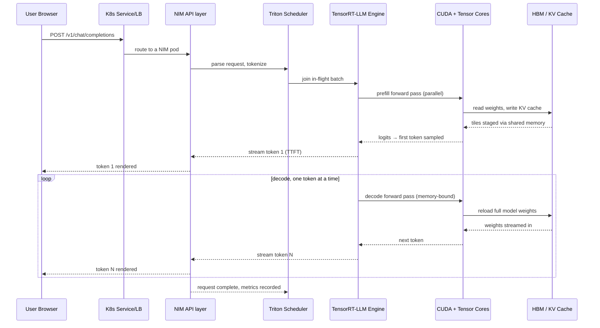

# Putting It All Together - One Request Through the Whole Stack

Parent: [[NVIDIA Stack]]

## 🪝 The Hook
Fifteen chapters, one question left: what actually happens, in order, when you type a message into a chat app and hit send? This chapter traces one request through **every single layer** of this book, top to bottom, so the whole stack finally clicks as one coherent story instead of fifteen separate ideas.

## ⚙️ Core Mechanism

### The scenario

You type "Explain HBM in one sentence" into a chat app backed by a NIM-served Llama-3-70B model running on a Kubernetes cluster with H100 nodes.

### The trace, layer by layer

1. **Browser/app** — your message becomes an HTTP POST to `/v1/chat/completions`, JSON body with your message and conversation history.
2. **Load balancer / Ingress** — the request hits a Kubernetes Service (created by the [[NIM Operator on Kubernetes]] from your `NIMService` object), which picks one of several running NIM pods.
3. **NIM container — API layer** — the OpenAI-compatible shim (see [[NIM - NVIDIA Inference Microservices]]) parses the request, validates it, converts it into Triton's internal request format.
4. **Triton Inference Server — scheduler** — the request joins the in-flight batch (see [[Triton Inference Server]] and [[Batching and Throughput]]) alongside other users' in-progress requests.
5. **Tokenization** — your text gets chopped into tokens and looked up in the embedding table (see [[Tokens and Embeddings]] in [[AI Inferencing]]) — this typically happens in a pre-processing step, sometimes on CPU, sometimes fused into the GPU pipeline.
6. **TensorRT-LLM engine — prefill** — the compiled engine (see [[TensorRT and TensorRT-LLM]]) runs a **prefill** forward pass over your entire prompt at once (see [[Prefill and Decode]]) — highly parallel, compute-bound (see [[How to Calculate GPU Inference - FLOPs Memory and Time]]).
7. **CUDA kernels dispatch** — the engine's compiled kernels get launched via the CUDA runtime (see [[CUDA and the Driver]]), using CUDA Graphs to minimize launch overhead.
8. **cuBLAS / fused attention kernels** — each transformer layer's matmuls and attention run through cuBLAS/cuDNN-derived fused kernels (see [[cuBLAS cuDNN and NCCL]]) or TensorRT-LLM's own custom kernels.
9. **Tensor Cores** — the actual multiply-accumulate math executes on Tensor Cores inside each SM (see [[Inside a GPU - SMs CUDA Cores and Tensor Cores]]), fed by tiles staged through shared memory and registers (see [[How a Matmul Runs on a GPU]]).
10. **HBM reads/writes** — every layer's weights stream from HBM into the SMs; the model's [[KV Cache]] gets populated with this prompt's Keys and Values (see [[GPU Memory Hierarchy - HBM L2 SRAM Registers]]).
11. **(If model spans multiple GPUs)** — NCCL AllReduce calls stitch together partial results across GPUs over NVLink/NVSwitch (see [[NVLink NVSwitch and InfiniBand]] and [[cuBLAS cuDNN and NCCL]]).
12. **First token sampled** — logits come out, a token gets sampled — this is **Time To First Token (TTFT)**, see [[Latency - TTFT and TPOT]] in [[AI Inferencing]].
13. **Decode loop begins** — the engine now runs one forward pass per token, this time memory-bandwidth-bound (see step 6's compute-bound contrast). Each step reloads the model's weights from HBM.
14. **(If enabled) Speculative decoding** — a small draft model proposes multiple tokens; the big engine verifies them in one batched pass (see [[Speculative Decoding]] in [[AI Inferencing]]).
15. **Streaming back out** — each decoded token streams back through Triton → NIM's API layer → the load balancer → your browser, appearing as the "typing" effect.
16. **Metrics** — Triton records latency/throughput; Prometheus scrapes it; if configured, KEDA/HPA (see [[NIM Operator on Kubernetes]]) uses it to decide whether to scale the deployment.
17. **Request completes** — the pod is now free to pick up the next queued request in the batch, and the whole loop repeats for the next token, the next user, forever.

### Sequence diagram

### The one-paragraph mental model

Everything above the GPU (browser, load balancer, NIM's API, Triton's scheduler) exists to **get the right bytes to the right compiled engine at the right time, and stream the answer back out**. Everything at and below the GPU (TensorRT-LLM, CUDA, Tensor Cores, HBM) exists to **do the actual math as fast as physics allows**. The entire book is really about optimizing those two halves separately, then gluing them together cleanly — which is exactly what NIM + Triton + the NIM Operator do.

### What changes for different request shapes

- **Long prompt, short reply** (e.g., document summarization) — bottlenecked mostly at steps 6–11 (prefill, compute-bound). TTFT dominates.
- **Short prompt, long reply** (e.g., story generation) — bottlenecked mostly at steps 13–15 (decode, memory-bound). TPOT dominates.
- **Many concurrent users** — batching (step 4) becomes the main lever; arithmetic intensity rises, throughput improves, per-user latency may worsen slightly (see the roofline discussion in [[How to Calculate GPU Inference - FLOPs Memory and Time]]).
- **Model too big for one GPU** — step 11's NCCL AllReduce becomes a real cost, and interconnect quality (NVLink domain size, see [[DGX HGX and Superpods]]) starts to matter as much as any single GPU's specs.

## 🔗 Connects To
- [[NVIDIA Stack]] — every chapter in this book appears somewhere in this trace
- [[AI Inferencing]] — the vendor-agnostic version of steps 5, 12–14
- [[Prefill and Decode]] — the two-phase shape this whole trace follows
- [[Cost of Inference]] — every layer in this trace is a place cost gets spent or saved
- [[NIM Operator on Kubernetes]] — the orchestration wrapper around this entire flow

## 💡 So What
When a real production AI request feels slow, this trace is a debugging checklist: is it the load balancer, the batch queue, prefill math, decode memory bandwidth, or cross-GPU communication? Each has a completely different fix. Understanding the whole path turns "AI is slow" from a mystery into a specific, answerable question.

## ❓ Open Question
As request patterns diversify (huge contexts, tool-calling loops, multi-turn agents making many small model calls), does this fifteen-year-old layered architecture (compile once, serve via scheduler) hold up — or do agentic workloads need a fundamentally different serving shape than one-shot chat completions?

## 📚 Source
- Synthesis of all prior chapters in [[NVIDIA Stack]]
- NVIDIA Triton + TensorRT-LLM + NIM architecture documentation, read together

---
*Status key: 🌱 seedling → 🌿 growing → 🌳 evergreen*
